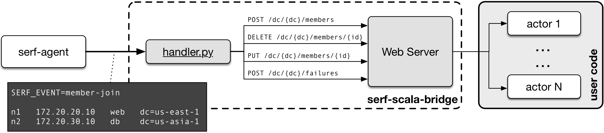

# serf-scala-bridge
This project provides a script and a simple REST service that can be used to bridge
Serf events and Akka actors.

[Serf](https://www.serf.io) is a tool from [Hashicorp](https://www.hashicorp.com)
used for cluster membership and failure detection. Serf is based on a set of standalone
agents that run in the cluster servers and exchange messages to implement the cluster
membership protocol. The occurrence of events, such as new members joining or leaving the
cluster, are signaled by the invocation of handler scripts. These scripts receive
information about the event types and members via environment variables and standard input.   

The components of this project work in tandem to receive this information and forward them
to actors. The figure below provides an overview of the project architecture.
 


There are two main parts involved:

* _handler.py_ script, which parses the input and invokes the corresponding REST services
([`bridge-script`](bridge-script));

* a _Web Server_, which provides a REST API for datacenter-aware cluster membership
([`bridge-server`](bridge-server));
 
The REST API can be configured with a set of actor references. All API invocations are
converted to messages that are forwarded to these actors (which, in turn,
integrate with your application).

## Running
The first thing you need to run the bridge is to create the actor implementations, which
will process the Serf messages, and to create a class to start the Web Server. Note the
[`WebServer`](bridge-server/src/main/scala/br/com/virsox/serfbridge/server/WebServer)
object in the [`bridge-server`](bridge-server) component only provides the route definition,
as defined by [akka-http](http://doc.akka.io/docs/akka-http/current/scala.html). An HTTP
object must be created and associated with the route to effectively start
the server. The class
[`QuorumWebServer`](bridge-sample/src/main/scala/br/com/virsox/serfbridge/sample/QuorumWebServer)
in project [`bridge-sample`](bridge-sample) shows how this can be done.

Both the handler script and the web server have been designed to run on the same node
as the Serf agent. A package containing all libraries needed to run the server
can be created using the sbt task `universal:packageZipTarball`. The resulting `.tar.gz`
file must be copied to the server and unzipped.

Based on the `bridge-sample` example, the following command is used to start the server:

```
node1:~$ NODE_DC=dc1 NODE_NAME=node1 ./bridge-sample
```

The two environment variables `NODE_DC` and `NODE_NAME` are used by the sample project to
define the nodes datacenter and name, but this is up to the implementation.

Once this is done, the serf agent can be initialized:

```
serf agent -node=node1 -tag dc=dc1 -event-handler=./handler.py -join 172.20.20.10
```

Because the service is datacenter-aware, it is assumed that every Serf node is tagged
with a `dc` tag, whose value should be equal to its datacenter identification. Note this
tag name currently cannot be changed. The other important part of this command is the
 `-event-handler` parameter, which must point to the `handler.py` script.
 
 


## Todo
This is the list of functionalities that still need to be added to the project:

* Support to query and user events;

* Create Ansible file to provision Serf nodes, including Serf agent and the Web Server. 
Ideally, both should be set up as operating system supervised services so that they are 
automatically started and restarted in case of failures;

* Adapt Vagrant file to use Ansible provisioning;
